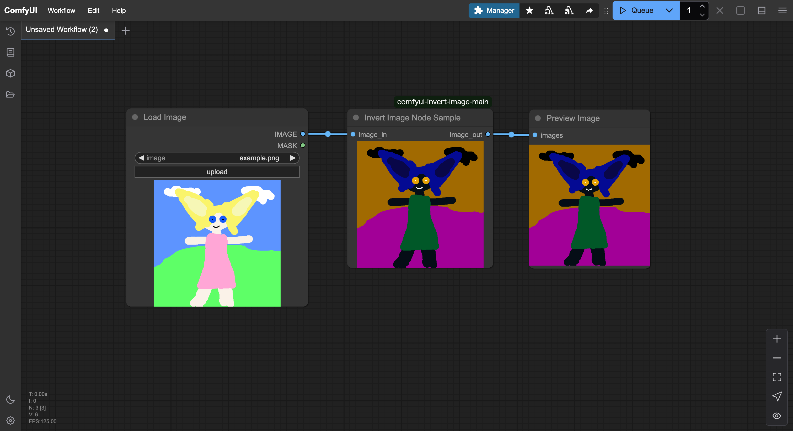

# ComfyUI Invert Image Node

このリポジトリは、ComfyUIのカスタムノードの実装例として、画像を反転させるシンプルなノードを提供します。プレビュー機能付きで、処理結果をリアルタイムに確認できます。



## 機能

- 入力画像の色を反転（ネガポジ反転）
- リアルタイムプレビュー表示
- バッチ処理対応
- レスポンシブなプレビュー表示

## インストール方法

### 方法1: Git を使用する場合

```bash
cd ComfyUI/custom_nodes
git clone https://github.com/your-username/comfyui-invert-image.git
```

### 方法2: 手動でインストール

1. このリポジトリをZIPファイルとしてダウンロード
2. ZIPファイルを解凍
3. フォルダを`ComfyUI/custom_nodes`ディレクトリに配置

## 使用方法

1. ComfyUIを起動
2. Add Node メニューから "example" → "Invert Image" を選択
3. 入力スロットに画像を接続
4. 実行すると、ノード上にプレビューが表示されます

### 基本的なワークフロー例

```
Load Image → Invert Image → Save Image
```

## 要件

- ComfyUI
- Python 3.8+
- PyTorch
- Pillow

## 開発者向け情報

### プロジェクト構造

```
comfyui-invert-image/
  ├─ __init__.py          # ノード登録
  ├─ invert_image_node.py # メイン実装
  └─ js/
      └─ invert_preview.js # フロントエンド実装
```

### カスタマイズ方法

プレビューのサイズやスタイルは `js/invert_preview.js` で調整可能です：

```javascript
container.style.minHeight = "200px";  // 最小高さ
container.style.maxHeight = "300px";  // 最大高さ
```

## ライセンス

MIT License - 詳細は [LICENSE](LICENSE) ファイルを参照してください。

## 謝辞

このプロジェクトは以下のリソースを参考にしています：

- [ComfyUI](https://github.com/comfyanonymous/ComfyUI)

## 貢献

1. このリポジトリをFork
2. 新しいブランチを作成 (`git checkout -b feature/amazing-feature`)
3. 変更をコミット (`git commit -m 'Add amazing feature'`)
4. ブランチをPush (`git push origin feature/amazing-feature`)
5. Pull Requestを作成

## よくある質問

Q: プレビューが表示されない  
A: ComfyUIの再起動を試してください。それでも解決しない場合は、ブラウザのコンソールでエラーを確認してください。

Q: 大きな画像を処理するとメモリエラーが出る  
A: プレビューのサイズ制限を調整するか、バッチサイズを小さくしてください。

## 更新履歴

- v1.0.0 (2024-02-24)
  - 初回リリース
  - 基本的な画像反転機能
  - プレビュー機能の実装